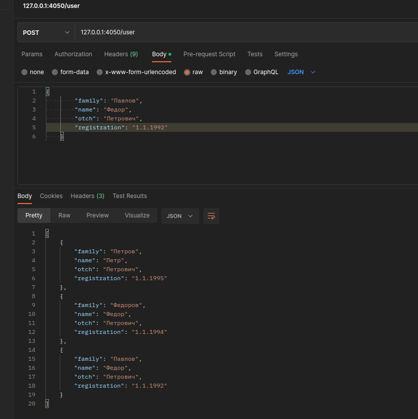
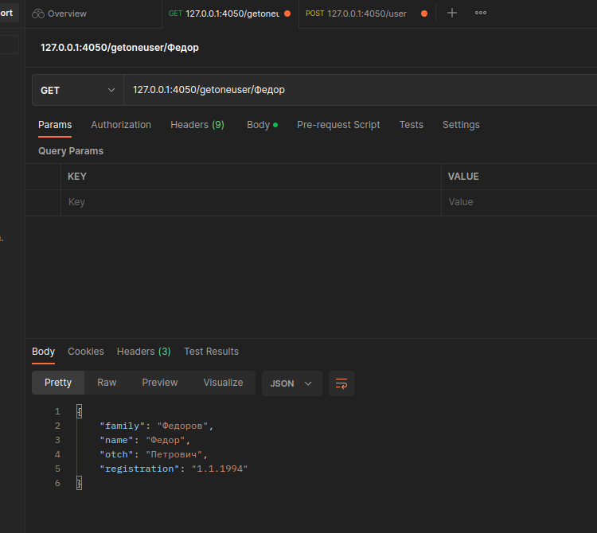
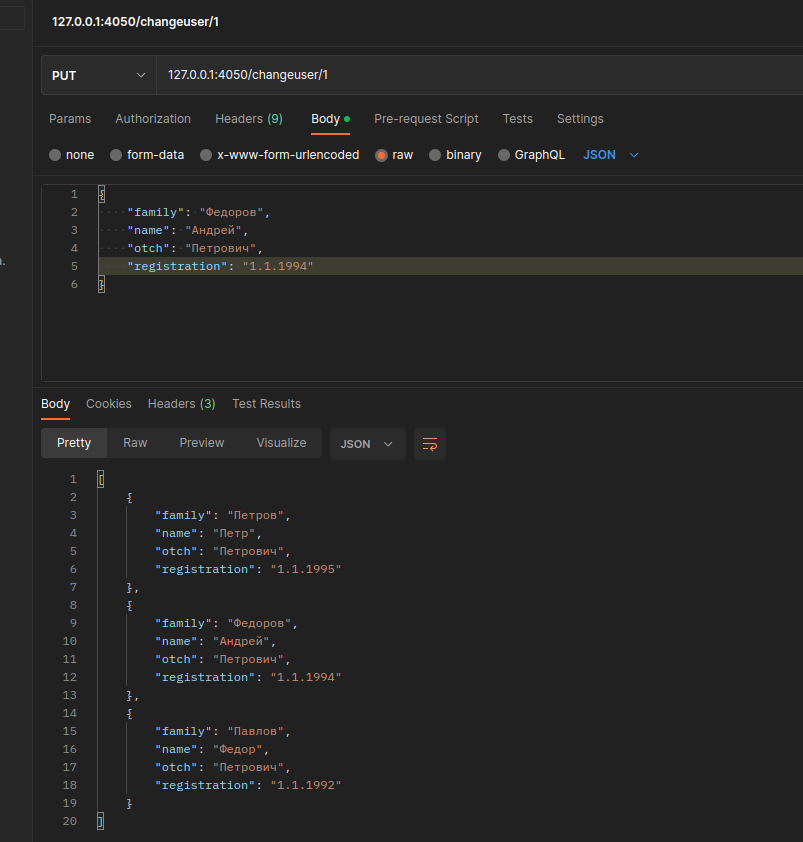
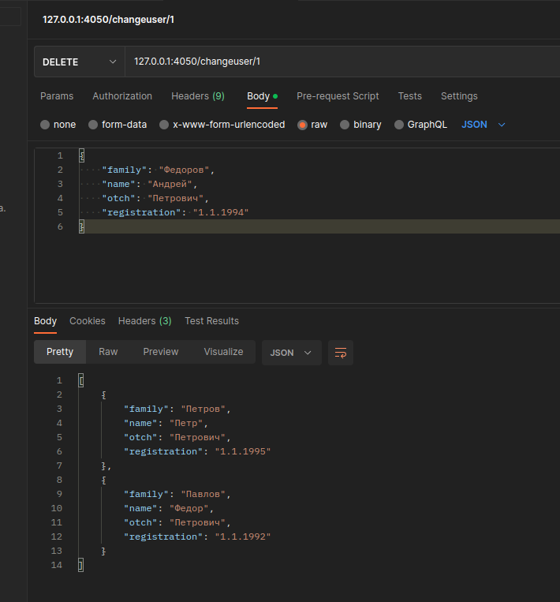
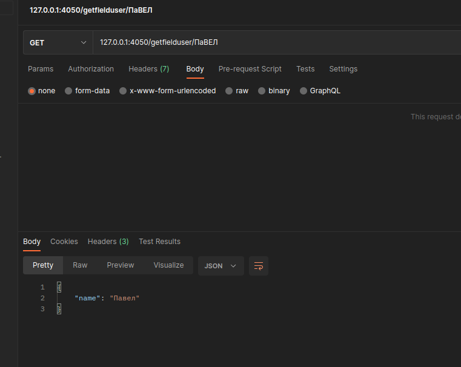

# Задача для стажера. :sunglasses:
____


#### Сделать HTTP  сервер (без применения фреймворков), умеющий создавать, изменять и удалять записи двух типов:
* Информация о покупателе
* Фамилия
* Имя
* Отчество
* Возраст (необязательное поле)
* Дата регистрации
_____
* Информацию о магазине 
* Название
* Адрес
* Работающий или нет
* Владелец (необязательное поле)
____
Непосредственную работу с записями необходимо осуществлять с использованием одной функции, умеющей принимать в качестве входного значения оба типа записи. Хранить и накапливать информацию можно по выбору: в рантайм, СУБД, файлах. Входными и выходными параметрами в  HTTP  запросах являются данные в формате  JSON.
На выходе сервис должен уметь возвращать всю запись, либо одно поле из записи в зависимости от запроса пользователя, осуществлять поиск по Фамилии и Названию  для соответствующих записей.

Можно немного усложнить ее, разбив на два микросервиса:

Сделать два микросервиса работающих через  GRPC:
1. HTTP сервер для общения с пользователем
2. Сервис хранения и обработки данных, в который ходит HTTP  сервер за данными.
Остальные вводные те же.

Для запросов использовал "POSTMAN" :fire:
___
    Примеры запросов
    _________________
    POST 127.0.0.1:4050/user - создает юзера
    POST 127.0.0.1:4050/shop - создает магазин
    -------------------------
    GET 127.0.0.1:4050/getallshops (getallusers) - получает все наименования
    GET 127.0.0.1:4050/getoneuser{title} getoneshop{title} - получает  одну запись
    GET 127.0.0.1:4050/getfielduser/{title} получает по значению одно поле
    GET 127.0.0.1:4050/getfieldshop/{title} получает по значению одно поле
    -------------------------
    PUT 127.0.0.1:4050/changeuser/{id} (changeshop/{id})  изменяет сущность
    -------------------------
    DELETE 127.0.0.1:4050/changeuser/{id} (changeshop/{id})  удаляет сущность


```go
Для запускаа установить зависимости и ввести:
________________________________________________
 go build -v ./cmd/goapitest && ./goapitest  
```






